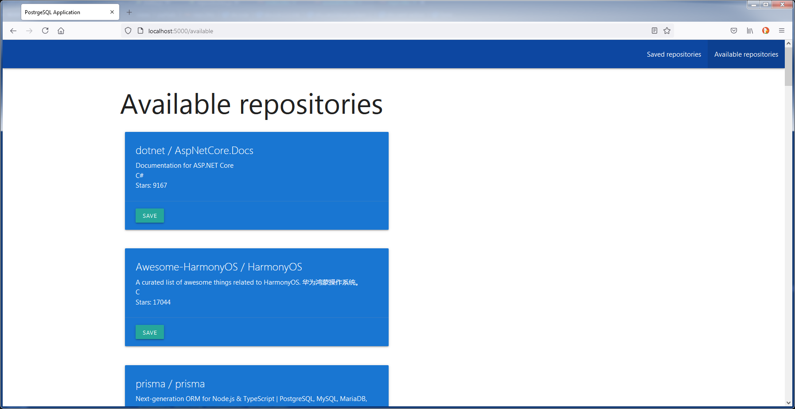

# NodeJS task

Solved NodeJS assingment.
Execute the following commands to run:
1. Change configurations in `.env`
2. Install dependencies via `npm i`
3. Run application via `npm run start` or debug with `npm run debug`